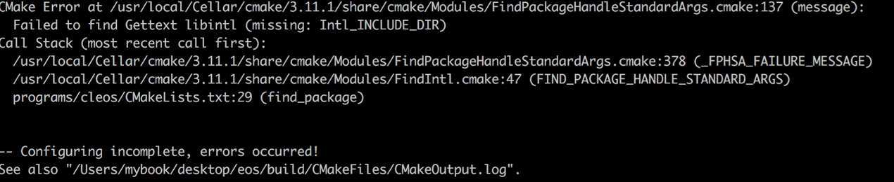

# Mac下搭建EOS环境

> 测试环境：

> * 系统版本：macOS High Sierra 10.13.3 
> * EOS版本：Dawn 3.0.0

---
## 1.编译设置开发环境
### 1.1 获取EOS源码及其所有子模块
以下这行代码的意思是从Github代码仓库上把EOS弄到本地
> $ git clone https://github.com/EOSIO/eos --recursive

如果在git clone中出现问题，多试几次

### 1.2 Boot
安装EOS会需要一些依赖的软件，大部分会自动安装。如果出现错误，提示你有些包版本不对，用`brew upgrade [软件名]`更新就是了。 
其中要注意的是Boost的安装。Boost是EOS需要的C++资源库。如果原本没有安装，那么直接`brew install boost`即可。如果原来已安装旧的版本，那么不要升级，直接卸载重新安装。
>brew uninstall --force boost  
brew install boost

安装完之后，用brew info boost查看,如图就说明你安装成功了！

## 2.编译源码生成可执行文件
### 2.1 进入git clone下来的eos文件夹
> cd eos  
ls
### 2.2 执行EOS的安装脚本
> ./eosio_build.sh

安装成功出现下图，说明EOS环境搭建成功

## 3.踩坑
如果在上面的过程中遇到任何的问题，可以先看看以下的方法能否解决
### 3.1 LLVM报错

> * 重新安装llvm
`brew reinstall llvm`

> * 修改.bash_profile 文件
`open .bash_profile`
在后面追加`export PATH="/usr/local/opt/llvm@4/bin:$PATH"`
如图
`source .bash_profile` (使用刚才更新之后的内容)
### 3.2 Gettext报错
> * 如图

> * 处理
`brew link gettext --force`

