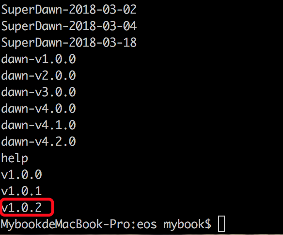
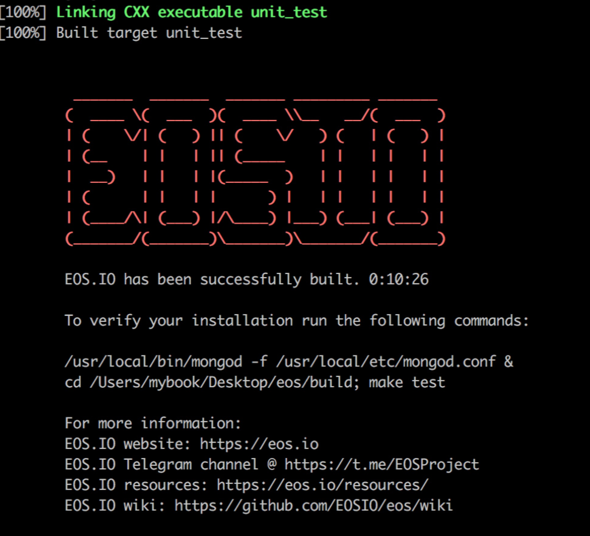

# 升级EOS系统 | 切换版本分支
Go or not go , eos 就在那里，我不太关心是否主网上线，而是专注于EOS的开发, 6月9日EOS主网终于要上线了，主网上线前，EOS几天一个新版本。新版本出来BUG也一大推，所以教程之前一直用EOSdawn-v3.0版本，没有更新。现在主网要上线了，代码也稳定下来了，因此是时候写一篇教程，教大家如何将本机的EOS系统升级为最新版本EOS1.0.2
---

## 1.实用小技巧介绍-git
### 1.1 拉最新的版本到本地
通过`git pull`命令
> * cd eos   #进入eos的根目录
> * git add .
> * git commit -m "升级版本" #先commit了才能Pull
> * git pull

### 1.2 查看软件版本
通过`git tag`命令，拉到最后，我们可以看到最新的版本是v1.0.2

### 1.3 建立新的分支
输入`git checkout -b [自己起的分支名] [用 tag 查到的版本名]` 
创建并切换到新的分支。 
例如`git checkout -b v1.0.2 v1.0.2` 
现在已经自动切换到v1.0.2分支了——也就是切换到了eosio 1.0.2 版本。

### 1.4 切换分支
之后想切换版本，先用`git branch`命令查看有哪些分支，然后`git checkout [分支名]`切换即可。注意，当没有找到你所需要的分支时，要先建立该分支

### 1.5 删除分支
有时候分支不小心建错了，用`git branch -d [分支名]`即可删除分支。 
注意，当前的分支是不能删除的，如果要删除当前分支，先`git branch`切换分支再进行删除操作。

### 1.6 重新安装
> * cd eos   #进入eos的根目录
> * ./eosio_build.sh

升级成功出现下图

其中可能报错说boost版本不对，卸载重装即可解决问题。
> * brew uninstall --force boost #卸载boost
> * cd /usr/local/Cellar/boost #进入boost所在的文件夹 
> * sudo rm -rf * #有时候里面的东西会对重装有影响，删了最好
> * brew install boost #安装最新版本 
> * brew link boost -force #强制链接

然后进入`eos/build`文件夹，构建可执行环境：
> * cd build
> * sudo make install

## 2.运行区块链
### 2.1 删除旧区块
打开以下路径文件夹,把data文件夹里面的内容删掉。
> cd /Users/[你的用户名]/Library/Application Support/eosio/nodeos 
> rm -rf *

### 2.2 修改配置文件
返回刚才那个文件夹，进入config文件夹，打开config.ini，
> cd /Users/[你的用户名]/Library/Application Support/eosio/nodeos 

将其中的`plugin=eosio::account_history_api_plugin`替换为`plugin = eosio::history_api_plugin`

然后我们进入`eos/build/programs/nodeos`，输入`./nodeos`，EOSIO 1.0.2就能顺利的跑起来啦！

