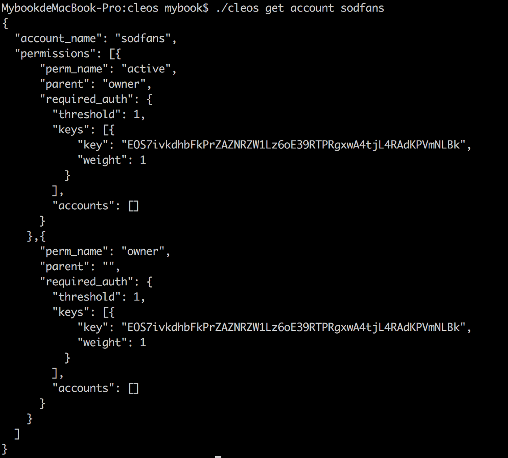

# 发个[大宝SOD币]

---
## 1.构建可执行环境
>确认当前文件夹是eos后，进入build文件夹 
`cd build`
构建可执行环境 
`sudo make install`

## 2.运行区块链
通过以下两个命令，我们就能在本机上运行EOS区块链了
>`cd build/programs/nodeos`
`./nodeos -e -p eosio --plugin eosio::wallet_api_plugin --plugin eosio::chain_api_plugin --plugin eosio::account_history_api_plugin`

执行命令后，EOS 系统会不断打包新的区块。其中，# 号后面的数字就是区块的编号。

## 3.钱包与账户的创建
### 3.1 创建钱包
（1）进入 cleos 文件夹：
>cd eos/build/programs/cleos    

（2）创建钱包：
>./cleos wallet create

如果成功，系统会返回给你一个钱包的私钥。如图

密码：PW5KUPRXv3FNhMTMgsZLFsDkxAAsdDfmoj2Sr1xQztfKtzd5gGKbp

### 3.2 加载 bios 合约
如果我们把 EOS 看做一个操作系统，那么 bios 合约就是让我们能进行最底层的操作的合约，其它合约的运行建立在 bios 合约的基础之上，所以我们先来加载 bios 合约。

>加载 bios 合约的命令如下：
`./cleos set contract eosio ../../contracts/eosio.bios -p eosio`
如图

### 3.3 在钱包内创建账户
在 EOS 中，一个钱包可以对应多个账户。在本例中，我们创建两个账户，一个是 currency 账户，用来执行「发币合约」的账户。另一个是 sodfans 账户，用来测试转账操作的普通账户。
> * 生成密钥对
./cleos create key

> * 钱包导入私钥
./cleos wallet import [ 生成的私钥 ]
例如：
`./cleos wallet import 5Jb2aU4n8EGA2JBUeXM8cTXywCkBXjwqvR4Sv7rF4JAk1q53tcT`

> * 用公钥创建账户 currency 。
注意了，创建账户本来需要两个公钥：OwnerKey 与 ActiveKey 。但是在本期中从简，第一步生成的密钥对用两次。
`./cleos create account eosio currency [ 生成的公钥 ] [ 生成的公钥 ]`
例如
`./cleos create account eosio currency EOS5MQyfpkKEecrGGy49TDJ9qF8bBSdJ8w6FiHHUBsZ32qWZvbqtU EOS5MQyfpkKEecrGGy49TDJ9qF8bBSdJ8w6FiHHUBsZ32qWZvbqtU`

重复以上步骤，创建账户 sodfans 
>./cleos create key

./cleos wallet import [ 生成的私钥 ]
例如`./cleos wallet import 5KN58YFrx1cuJLRca9hs5nd6LxT7w2SMLnACKSLPVnRWnie2qkx`
./cleos create account eosio sodfans [ 生成的公钥 ] [ 生成的公钥 ]
例如`./cleos create account eosio sodfans EOS7ivkdhbFkPrZAZNRZW1Lz6oE39RTPRgxwA4tjL4RAdKPVmNLBk EOS7ivkdhbFkPrZAZNRZW1Lz6oE39RTPRgxwA4tjL4RAdKPVmNLBk`

检查一下两个账户是否已经存在了
>./cleos get account [ 账户名 ]

## 4.发行[大宝SOD币]
现在有三个账户—— eosio 账户（默认）、currency 账户和 sodfans 账户。现在我们用 currency 账户加载并执行「发币合约」，发行大宝币。
### 4.1 加载合约
> * 先看一下currency账户的合约情况
`./cleos get code currency`
返回的结果是一串为0的hash，说明合约还未创建。

> * 加载系统自带的发币合约
`./cleos set contract currency ../../contracts/currency`

> * 再次看一下currency账户的合约情况,如果发现 code hash 不是 0 了，就说明发币合约加载成功！

### 4.2 用 currency 账户执行「发币合约」，创建大宝SOD币
> * 执行下面命令：
`./cleos push action currency create '{"issuer":"currency", "maximum_supply": "1000000000.0000 SOD", "can_freeze": 1, "can_recall": 1, "can_whitelist": 1}' -p currency@active`
如果返回以下结果，就说明我们创建币成功了！

### 4.3 发送大宝SOD币给 currency 账户
虽然目前大宝币创建成功了，但还没有账户持有大宝币。所以，我们要给账户「发币」
> * 执行下面命令：
`./cleos push action currency issue '{"to":"currency","quantity":"1000.0000 SOD","memo":""}' --permission currency@active`
我们就给 currency 账户发了 1000 个 SOD 币

> * 验证一下，通过以下命令查看 currency 账户余额
`./cleos get table currency currency accounts`

返回的结果告诉我们，currency 的账户里的确有 1000个SOD了！

### 4.4 测试转账操作
> * 通过如下命令，currency 账户会将20个SOD币转给sodfans账户：
`./cleos push action currency transfer '{"from":"currency","to":"sodfans","quantity":"20.0000 SOD","memo":"my first transfer"}' --permission currency@active`

> * 查看 currency 和 sodfans 两个账户的余额
`./cleos get table currency sodfans accounts`

`./cleos get table currency currency accounts`

